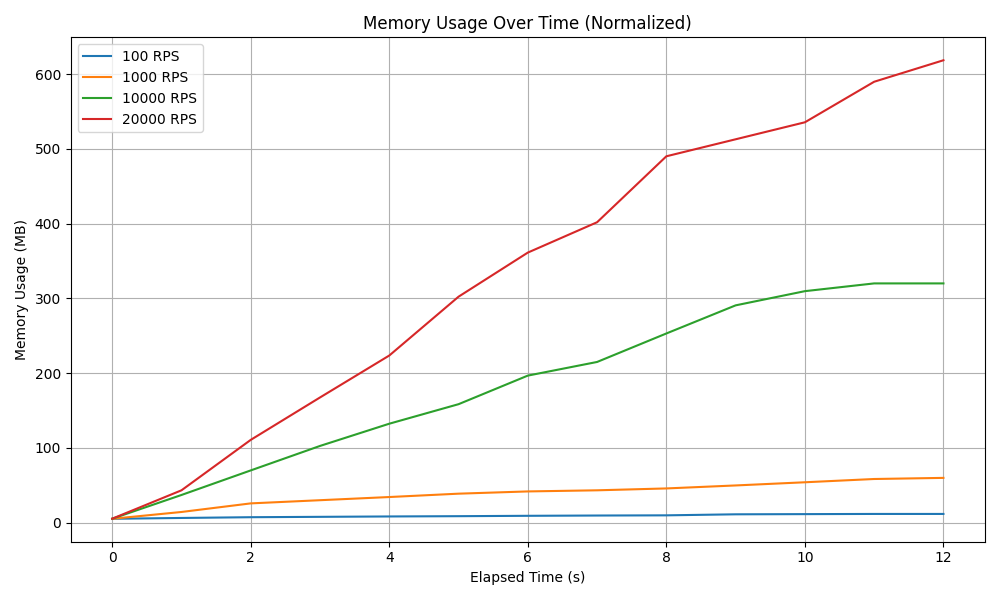

# Demo of Adhoc Memory Usage Tracking

Track and visualize memory usage in the Go application.

We use a bash script to track memory usage by reading VmRSS from `/proc/<pid>/status`. 

## Limitations

- VmRSS measures only physical memory, excluding shared memory, leading to potential underestimation.
- The script captures data every second, missing rapid memory fluctuations.
- If the process ends, logging stops, losing critical pre-termination data.

## Prerequisites

- Go 1.20+
- Python 3.10+
- Python libraries: `pandas`, `matplotlib`
- k6 for load testing

## Installation

Clone the repo.

Install Python deps.
```
python3.10 -m venv venv
source venv/bin/activate
pip install pandas matplotlib
```

## Usage

1. **Run Tracking and Load Test:**
   ```bash
   ./run_all.sh "go run cmd/server_http"
   ```

2. **Generate Plot:**
   ```bash
   python3 plot_mem.py
   ```

3. **Open Plot:**
   ```bash
   open out/memory_usage_plot_normalized.png
   ```

### Explanation of `run_all.sh` Script

1. **Start the Go server** and retrieve its PID.
2. **Run memory tracking** and load tests using `k6`.
3. **Stop the server** and save memory usage data.

### Example Output

The graph shows memory rising from 5MB to 500MB in 10 seconds under 20,000 RPS. This intentional goroutine leak causes linear memory growth, a common symptom of memory leaks.


